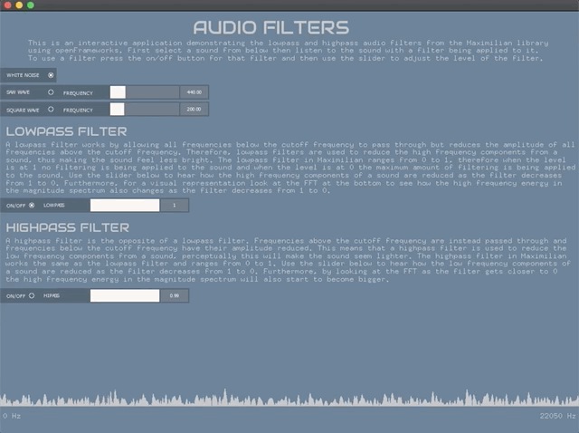

# Audio-Filters
An interactive application that demonstrates lowpass and highpass audio filters, written in C++ using the framework openFrameworks.  

**Video link:** https://vimeo.com/436783480

**Prerequisites:** openFrameworks, ofxMaxim, ofxDatGui

**Step 1:** Download openFrameworks and follow the setup guide for your OS and IDE.

**Step 2:** Download or clone the additional openFrameworks libraries (ofxMaxim, ofxDatGui) into the openFrameworks/addons directory.

**Step 3:** Create a new project using the projectGenerator, located in the directory openFrameworks/projectGenerator. Then using the addons button, add ofxMaxim and ofxDatGui to the project.

**Step 4:** Open the project in your IDE then from inside your IDE delete all the files inside the src directory.

**Step 5:** Download or clone this repo then copy the files inside the src directory of this repo into the src directory of the project you created.

**Step 6:** Compile the project.
